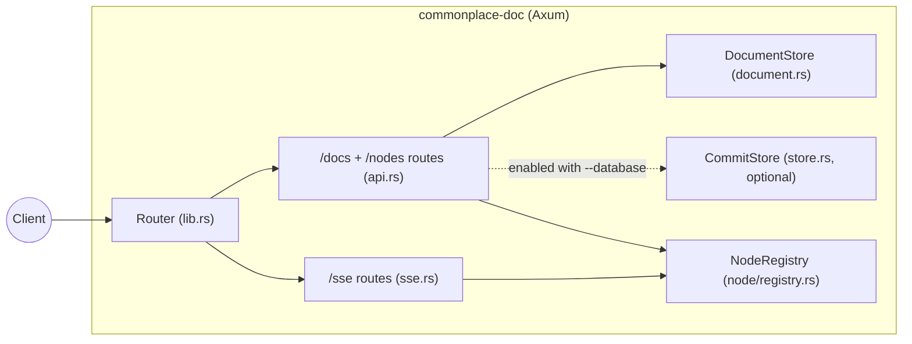
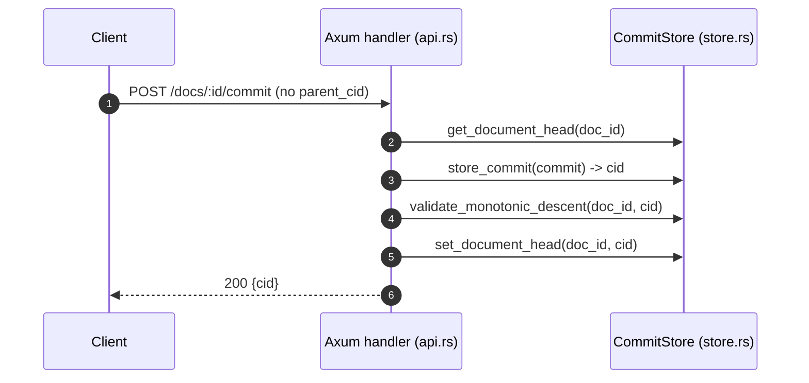
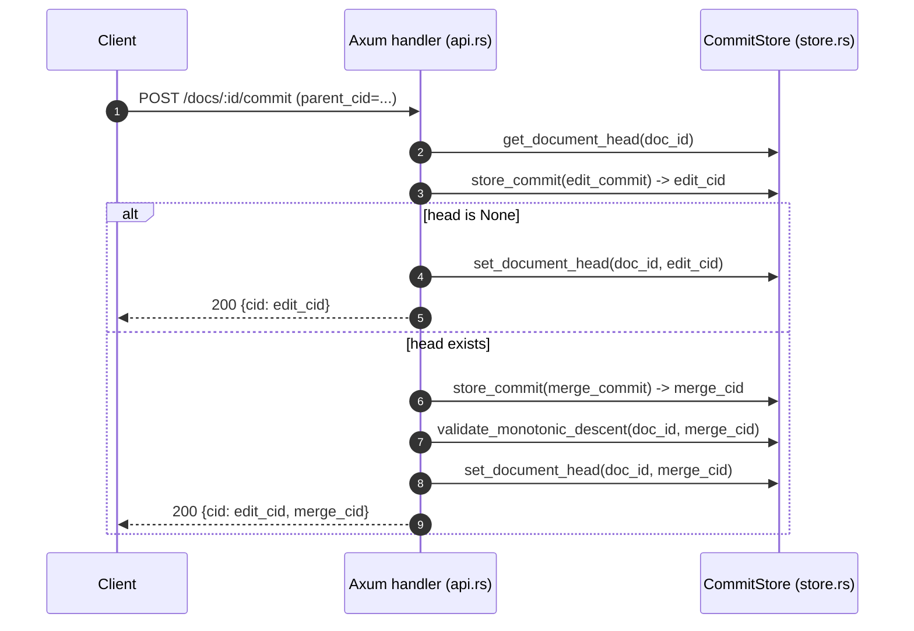
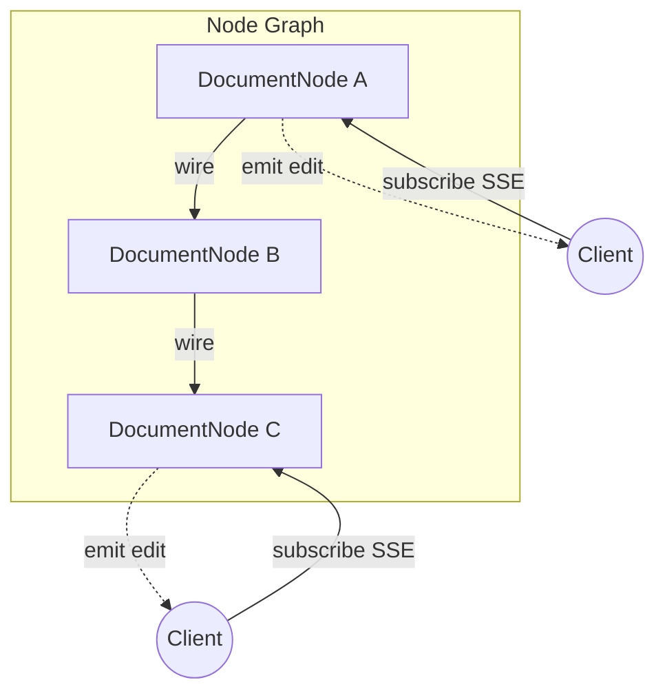
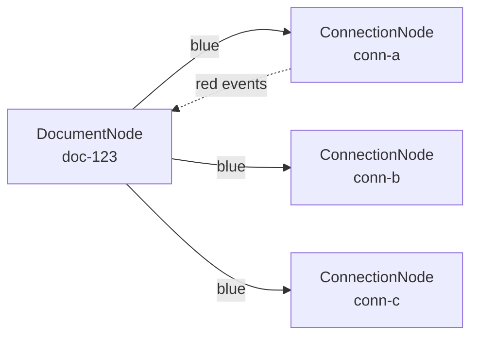

# Architecture

This repo is a small Axum-based HTTP server with three main subsystems:

- **Documents**: in-memory, created and fetched via `/docs`.
- **Commits**: optional, persisted to a local `redb` file and created via `/docs/:id/commit`.
- **Nodes**: reactive document graph via `/nodes` - nodes receive/emit edits and events, can be wired together.

For `text/plain`, `application/json`, and `application/xml` documents, commits are interpreted as Yjs (Yrs) updates and applied to the in-memory document body.

Internally, each document uses a Yrs root type named `content`:

- `text/plain`: `Y.Text("content")`
- `application/json`: `Y.Map("content")` (serialized to JSON)
- `application/xml`: `Y.XmlFragment("content")` (serialized as `<?xml...?><root>…</root>`)

## Code Map

- `src/main.rs`: CLI parsing, tracing setup, server bind + serve.
- `src/lib.rs`: router construction (`create_router_with_store`).
- `src/cli.rs`: CLI flags (`--database`, `--host`, `--port`).
- `src/api.rs`: REST routes under `/docs` and `/nodes`.
- `src/document.rs`: `DocumentStore` + `ContentType`.
- `src/commit.rs`: `Commit` model + CID calculation.
- `src/store.rs`: `CommitStore` backed by `redb`.
- `src/sse.rs`: `/sse/docs/:id` real-time event stream.
- `src/node/mod.rs`: `Node` trait definition.
- `src/node/types.rs`: `NodeId`, `Edit`, `Event`, `NodeMessage`, `NodeError`.
- `src/node/subscription.rs`: `Subscription`, `SubscriptionId`.
- `src/node/document_node.rs`: `DocumentNode` implementation.
- `src/node/registry.rs`: `NodeRegistry` with cycle detection.

## Runtime Entry Points

### Binary startup

`src/main.rs` is the executable entrypoint:

1. Parse CLI args (`Args::parse()`).
2. Configure tracing (`tracing_subscriber` with `EnvFilter`).
3. If `--database <path>` is provided, create a `CommitStore` (`CommitStore::new(path)`).
4. Build the Axum router via `create_router_with_store(commit_store)`.
5. Bind `TcpListener` on `<host>:<port>` and serve.

### Router composition

`src/lib.rs:create_router_with_store` composes the app:

- `GET /health` (simple liveness)
- merge `api::router(store, node_registry)` (document REST + node endpoints)
- nest `sse::router(node_registry)` under `/sse`
- permissive CORS (`CorsLayer::permissive()`)



## State and Concurrency Model

### Documents: `DocumentStore` (in-memory)

`src/document.rs` stores documents in:

- `Arc<RwLock<HashMap<String, Document>>>`

Each `Document` has:

- `content: String` (initialized to a default for the content type)
- `content_type: ContentType` (JSON/XML/Text)
- `ydoc: yrs::Doc` (Yrs document holding the collaborative state, rooted at `content`)

Operations:

- `create_document(content_type) -> id`: generates a UUIDv4 string, inserts a new doc.
- `get_document(id) -> Option<Document>`: read-lock and clone.
- `delete_document(id) -> bool`: write-lock and remove.

### Commits: `CommitStore` (optional persistent store)

`src/store.rs` wraps a `redb::Database`:

- `Arc<RwLock<Database>>`

Tables:

- `commits`: key = CID (hex string), value = JSON-encoded `Commit`
- `doc_heads`: key = `doc_id`, value = current head CID

The commit store is only constructed when the server is started with `--database`. If not provided, the commit endpoint is disabled.

## HTTP API Flows

`src/api.rs` builds state:

- `doc_store: Arc<DocumentStore>`
- `commit_store: Option<Arc<CommitStore>>`

and mounts routes:

- `POST /docs` (create)
- `GET /docs/:id` (fetch)
- `DELETE /docs/:id` (delete)
- `POST /docs/:id/commit` (persist commit; requires database)

### Create and fetch a document

Creating a document uses the request `Content-Type` header to select `ContentType`:

- `application/json`
- `application/xml` (or `text/xml`)
- `text/plain`

The server stores a doc with “default content” for that type; `GET /docs/:id` returns that content and the matching `Content-Type` response header.

### Commit creation and “monotonic descent”

Commits are created via `POST /docs/:id/commit`.

Key behaviors:

- If no `--database` was supplied, this endpoint returns `501 Not Implemented`.
- The request body includes a `"verb"`; only `"update"` is supported.
- The `"value"` is stored in `Commit.update` (documented as a base64 Yjs update string, not validated today).
- The server tracks a per-document **head** CID in `doc_heads`.

#### CID definition

`src/commit.rs:Commit::calculate_cid`:

- serializes the whole `Commit` to JSON via `serde_json::to_string`
- hashes it with SHA-256
- returns a hex string

Because the JSON includes `timestamp` (set at commit creation time), the CID changes across commits even if other fields match.

Note: `Commit.extensions` is a `HashMap`; if you ever use non-empty extensions, JSON key ordering can be non-deterministic, which would make CIDs unstable for the same logical content.

#### Monotonic descent rule

`src/store.rs:validate_monotonic_descent(doc_id, new_cid)` enforces:

- If the document has no head, any commit is acceptable.
- If there is a head CID, the new commit must have the current head as an ancestor (the head must be reachable by recursively walking `parents`).

This prevents “moving head backwards” to an unrelated history.

#### Simple commit (no `parent_cid`)

1. Read current head CID for the document.
2. Create a new `Commit` whose `parents` are either `[head]` or `[]`.
3. Store the commit by CID in `commits`.
4. Validate monotonic descent against current head.
5. Update `doc_heads[doc_id] = new_cid`.



#### Merge workflow (`parent_cid` provided)

If the client provides `parent_cid`, the server performs a two-step write:

1. Create an “edit commit” whose only parent is the supplied `parent_cid`.
2. If there is no current head, the edit commit becomes the head and the request completes.
3. Otherwise create a “merge commit” with parents `[edit_cid, current_head]` and an empty update payload.
4. Validate monotonic descent on the **merge commit** (it includes the current head as a parent).
5. Set document head to the merge commit.

The response returns:

- `cid`: the edit commit CID
- `merge_cid`: the merge commit CID (when created)



## Node System

The Node system provides a reactive abstraction for document processing. Nodes receive and emit **edits** (commits) and **events** (ephemeral JSON messages).

### Node Trait

`src/node/mod.rs` defines the `Node` trait:

```rust
#[async_trait]
pub trait Node: Send + Sync {
    fn id(&self) -> &NodeId;
    fn node_type(&self) -> &'static str;

    // Receiving
    async fn receive_edit(&self, edit: Edit) -> Result<(), NodeError>;
    async fn receive_event(&self, event: Event) -> Result<(), NodeError>;

    // Subscribing
    fn subscribe(&self) -> Subscription;
    fn subscriber_count(&self) -> usize;

    // Lifecycle
    async fn shutdown(&self) -> Result<(), NodeError>;
    fn is_healthy(&self) -> bool;
}
```

### Core Types

`src/node/types.rs` defines:

- **`NodeId(String)`**: Unique node identifier
- **`Edit`**: Wraps a `Commit` with source `NodeId`
- **`Event`**: Ephemeral message with `event_type`, JSON `payload`, and source `NodeId`
- **`NodeMessage`**: `Edit(Edit) | Event(Event)` - emitted to subscribers
- **`NodeError`**: Error variants (NotFound, InvalidEdit, CycleDetected, Shutdown, etc.)

### DocumentNode

`src/node/document_node.rs` implements `Node` for documents:

- Wraps a Yjs document with `content` and `content_type`
- Uses `tokio::sync::broadcast` channel for emissions
- On `receive_edit`: decodes base64 update, applies to Yjs doc, emits to subscribers
- On `receive_event`: forwards to subscribers unchanged

### NodeRegistry

`src/node/registry.rs` manages the node graph:

- `HashMap<NodeId, Arc<dyn Node>>` for node storage
- `wire(from, to)`: Spawns a task that forwards messages from `from` to `to`
- `unwire(subscription_id)`: Aborts the forwarding task
- **Cycle detection**: Before wiring, DFS checks if `to` can reach `from` (would create cycle)



### Node API Routes

`src/api.rs` exposes:

- `POST /nodes`: Create a node (type: "document")
- `GET /nodes`: List all nodes
- `GET /nodes/:id`: Get node info
- `DELETE /nodes/:id`: Delete node
- `POST /nodes/:id/edit`: Send edit to node
- `POST /nodes/:id/event`: Send event to node
- `POST /nodes/:from/wire/:to`: Wire nodes
- `DELETE /nodes/:from/wire/:to`: Unwire nodes

## SSE Endpoint

`src/sse.rs` exposes `GET /sse/docs/:id`:

- Subscribes to CommitBroadcaster for the document
- Streams commit notifications as SSE events
- Edit events have type `edit` with commit data (update, parents, timestamp, author, message)
- Emits `warning` if subscription lags

Updates made via API endpoints are immediately streamed to SSE subscribers.

## Blue and Red Edges

Nodes communicate through two distinct types of connections, visualized as "blue" and "red" edges:

### Blue Edges (Edits/Updates)

Blue edges carry **persistent document changes**:

- **What they carry**: Yjs CRDT commits (merkle-tree nodes with parent references)
- **Downstream** (subscribe to blue port): Watch a node to see document changes
- **Upstream** (push to blue port): Send edits back to modify the document
- **Constraint**: You must listen before editing - edits require parent context from the commit graph
- **Storage**: Commits are content-addressed (CID) and optionally persisted to the commit store

```
   [Client]                    [DocumentNode]
       |                            |
       |--- subscribe_blue() ------>|  (downstream: watch changes)
       |<------- Edit --------------|
       |                            |
       |-------- Edit ------------->|  (upstream: push edit, needs parent CID)
       |                            |
```

### Red Edges (Events)

Red edges carry **ephemeral messages**:

- **What they carry**: JSON envelopes with arbitrary payloads (cursors, presence, metadata)
- **Fire**: Any client can POST an event to any node's red port (no subscription required)
- **Subscribe**: Optionally watch a node's red broadcasts
- **Independence**: Inbound events (what a node receives) and outbound events (what it broadcasts) are unrelated
- **No persistence**: Events are fire-and-forget, not stored

```
   [Any Client]                [Node]                    [Subscriber]
        |                        |                            |
        |--- POST event -------->|  (fire at red port)        |
        |                        |                            |
        |                        |--- event broadcast ------->|  (red subscription)
        |                        |                            |
```

### Node Types

| Type | Lifecycle | Purpose |
|------|-----------|---------|
| **Document node** | Persistent | Wraps a Yjs document, applies edits, emits changes |
| **Connection node** | Transient | Represents an SSE client, cleaned up on disconnect |
| **Virtual node** | Lazy | Created on-demand when first subscribed to by UUID |

### Fanout Model

The node graph enables fanout subscriptions:



- Multiple SSE clients subscribe to the same document
- Each gets a transient ConnectionNode with a server-generated UUID
- Edits flow downstream (blue), events can flow in any direction (red)
- When TCP connection closes, the ConnectionNode is automatically cleaned up

## Known Limitations / Intentional Gaps

- Document bodies are in-memory only (not persisted).
- `text/plain`, `application/json`, and `application/xml` documents apply commits to the document body today.
- Commit updates are expected to be base64-encoded Yjs updates.
- CID stability can be impacted if `extensions` is ever populated (unordered map).
- Node system is separate from the `/docs` endpoints (they use different storage).
- Only `document` node type is currently implemented (future: computed, aggregator, gateway nodes).
