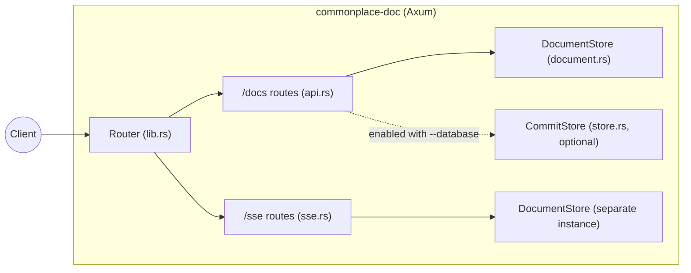
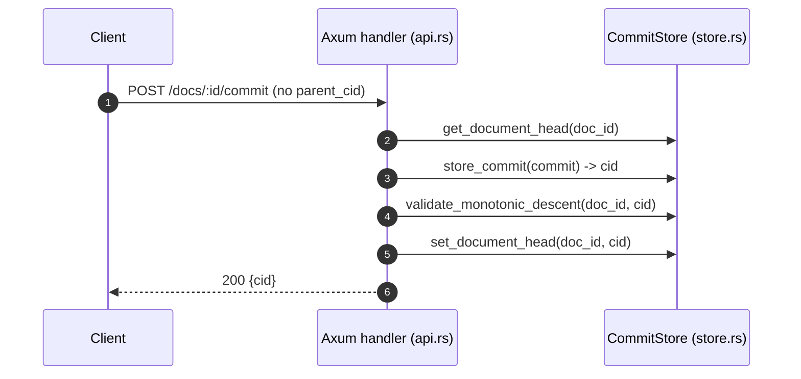
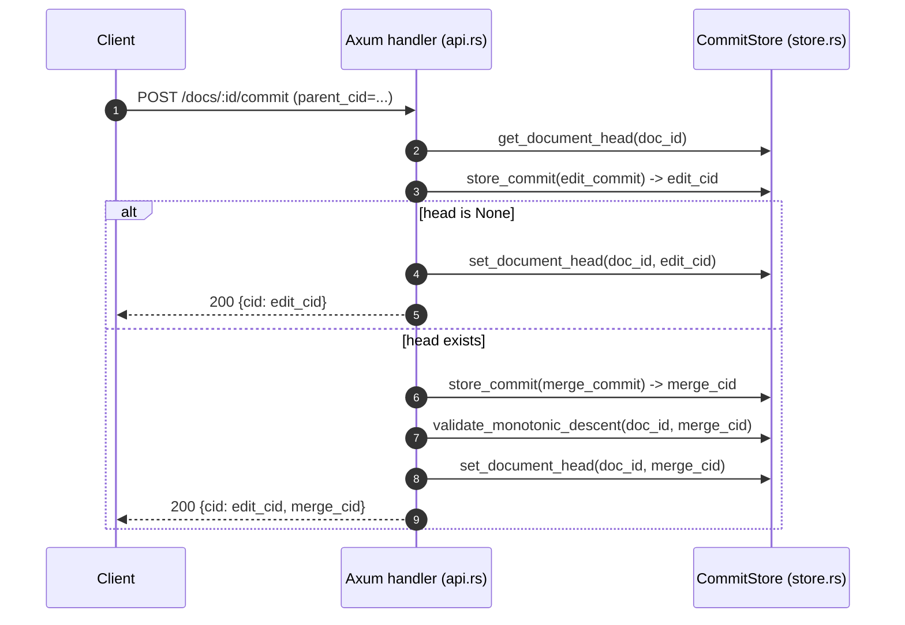

# Architecture

This repo is a small Axum-based HTTP server with two separate “tracks” of state:

- **Documents**: in-memory, created and fetched via `/docs`.
- **Commits**: optional, persisted to a local `redb` file and created via `/docs/:id/commit`.

For `text/plain` documents, commits are interpreted as Yjs (Yrs) updates and applied to the in-memory document body. For other content types, commits are stored but not applied to `Document.content` yet.

## Code Map

- `src/main.rs`: CLI parsing, tracing setup, server bind + serve.
- `src/lib.rs`: router construction (`create_router_with_store`).
- `src/cli.rs`: CLI flags (`--database`, `--host`, `--port`).
- `src/api.rs`: REST routes under `/docs`.
- `src/document.rs`: `DocumentStore` + `ContentType`.
- `src/commit.rs`: `Commit` model + CID calculation.
- `src/store.rs`: `CommitStore` backed by `redb`.
- `src/sse.rs`: `/sse/documents/:id` heartbeat stream (placeholder).

## Runtime Entry Points

### Binary startup

`src/main.rs` is the executable entrypoint:

1. Parse CLI args (`Args::parse()`).
2. Configure tracing (`tracing_subscriber` with `EnvFilter`).
3. If `--database <path>` is provided, create a `CommitStore` (`CommitStore::new(path)`).
4. Build the Axum router via `create_router_with_store(commit_store)`.
5. Bind `TcpListener` on `<host>:<port>` and serve.

### Router composition

`src/lib.rs:create_router_with_store` composes the app:

- `GET /health` (simple liveness)
- merge `api::router(store)` (document REST + commit endpoint)
- nest `sse::router()` under `/sse`
- permissive CORS (`CorsLayer::permissive()`)

## State and Concurrency Model

### Documents: `DocumentStore` (in-memory)

`src/document.rs` stores documents in:

- `Arc<RwLock<HashMap<String, Document>>>`

Each `Document` has:

- `content: String` (initialized to a default for the content type)
- `content_type: ContentType` (JSON/XML/Text)

Operations:

- `create_document(content_type) -> id`: generates a UUIDv4 string, inserts a new doc.
- `get_document(id) -> Option<Document>`: read-lock and clone.
- `delete_document(id) -> bool`: write-lock and remove.

### Commits: `CommitStore` (optional persistent store)

`src/store.rs` wraps a `redb::Database`:

- `Arc<RwLock<Database>>`

Tables:

- `commits`: key = CID (hex string), value = JSON-encoded `Commit`
- `doc_heads`: key = `doc_id`, value = current head CID

The commit store is only constructed when the server is started with `--database`. If not provided, the commit endpoint is disabled.

## HTTP API Flows

`src/api.rs` builds state:

- `doc_store: Arc<DocumentStore>`
- `commit_store: Option<Arc<CommitStore>>`

and mounts routes:

- `POST /docs` (create)
- `GET /docs/:id` (fetch)
- `DELETE /docs/:id` (delete)
- `POST /docs/:id/commit` (persist commit; requires database)

### Create and fetch a document

Creating a document uses the request `Content-Type` header to select `ContentType`:

- `application/json`
- `application/xml` (or `text/xml`)
- `text/plain`

The server stores a doc with “default content” for that type; `GET /docs/:id` returns that content and the matching `Content-Type` response header.

### Commit creation and “monotonic descent”

Commits are created via `POST /docs/:id/commit`.

Key behaviors:

- If no `--database` was supplied, this endpoint returns `501 Not Implemented`.
- The request body includes a `"verb"`; only `"update"` is supported.
- The `"value"` is stored in `Commit.update` (documented as a base64 Yjs update string, not validated today).
- The server tracks a per-document **head** CID in `doc_heads`.

#### CID definition

`src/commit.rs:Commit::calculate_cid`:

- serializes the whole `Commit` to JSON via `serde_json::to_string`
- hashes it with SHA-256
- returns a hex string

Because the JSON includes `timestamp` (set at commit creation time), the CID changes across commits even if other fields match.

Note: `Commit.extensions` is a `HashMap`; if you ever use non-empty extensions, JSON key ordering can be non-deterministic, which would make CIDs unstable for the same logical content.

#### Monotonic descent rule

`src/store.rs:validate_monotonic_descent(doc_id, new_cid)` enforces:

- If the document has no head, any commit is acceptable.
- If there is a head CID, the new commit must have the current head as an ancestor (the head must be reachable by recursively walking `parents`).

This prevents “moving head backwards” to an unrelated history.

#### Simple commit (no `parent_cid`)

1. Read current head CID for the document.
2. Create a new `Commit` whose `parents` are either `[head]` or `[]`.
3. Store the commit by CID in `commits`.
4. Validate monotonic descent against current head.
5. Update `doc_heads[doc_id] = new_cid`.

#### Merge workflow (`parent_cid` provided)

If the client provides `parent_cid`, the server performs a two-step write:

1. Create an “edit commit” whose only parent is the supplied `parent_cid`.
2. If there is no current head, the edit commit becomes the head and the request completes.
3. Otherwise create a “merge commit” with parents `[edit_cid, current_head]` and an empty update payload.
4. Validate monotonic descent on the **merge commit** (it includes the current head as a parent).
5. Set document head to the merge commit.

The response returns:

- `cid`: the edit commit CID
- `merge_cid`: the merge commit CID (when created)

## SSE Endpoint (Placeholder)

`src/sse.rs` exposes `GET /sse/documents/:id` and currently:

- emits a `heartbeat` event every 30 seconds
- does not observe document state

Important detail: `sse::router()` creates its own `DocumentStore` instance, separate from the API’s `DocumentStore`. Even if SSE were extended to read docs, it would currently be looking at a different in-memory store.

## Known Limitations / Intentional Gaps

- Document bodies are in-memory only (not persisted).
- Only `text/plain` documents apply commits to the document body today.
- Commit updates are expected to be base64-encoded Yjs updates; for `text/plain` they are decoded and applied via Yrs.
- SSE is heartbeats only and not wired to document/commit changes.
- CID stability can be impacted if `extensions` is ever populated (unordered map).
